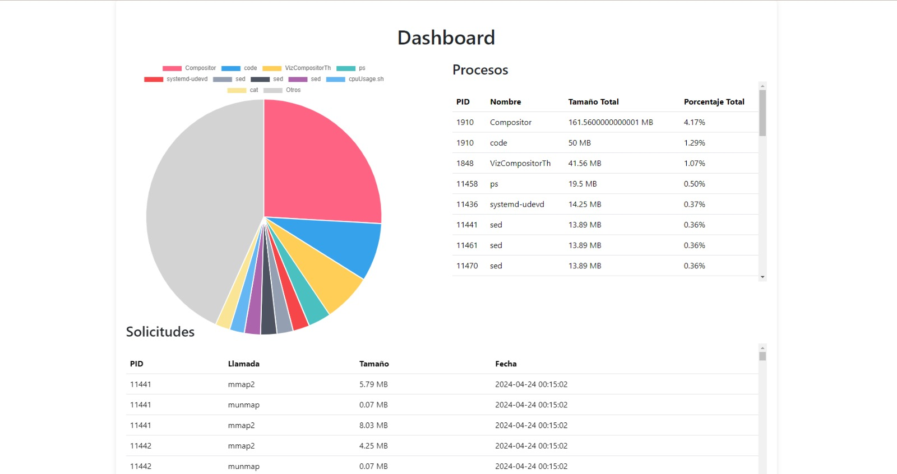

# PROYECTO Sistemas Operativos 2 2024

## Manejo de Memoria

**Estudiante:** Josseline Suseth Godinez Garcia  
**Carnet:** 201503841

**Estudiante:** José Diego Perez Toralla  
**Carnet:** 201504081

## Objetivos

- Entender cómo funcionan el manejo de memoria en Linux. 
- Comprender como funcionan las solicitudes de memoria de los procesos. 
- Realizar reportes sobre la utilización de memoria. 

## Descripción
La gestión de la memoria es un aspecto crítico del rendimiento del sistema, ya que garantiza la  utilización eficiente de los recursos y mantiene la estabilidad bajo diferentes cargas de trabajo. Al monitorear exhaustivamente la memoria, se puede obtener información valiosa sobre el  comportamiento de su sistema, identificar posibles cuellos de botella y optimizar la asignación de recursos. En este proyecto se creara una aplicación capaz de monitorear el uso de memoria de cada proceso abierto en Linux, detectando las solicitudes de memoria que estos realizan al sistema operativo.

## API de Procesos
La API de procesos está configurada para manejar solicitudes HTTP y devolver datos relacionados con los procesos. Un endpoint específico (/api/ObtenerProcesos) ejecuta la consulta SQL para agrupar y ordenar los procesos por uso de memoria elaborada en nodejs.


## Dashboard 
En este dashboard se puede ver una tabla donde se podrá leer: 
- PID del proceso. 
- Nombre del proceso. 
- Cantidad de memoria que posee el proceso (mmap – munmap). 
- Porcentaje al que equivale la memoria del proceso a la memoria total del sistema.
- Así mismo una gráfica de pie donde se muestra que porcentaje de toda la memoria solicitada fue realizada por cada proceso.
- Por último, se incluyo una tabla donde se listan todas las llamadas solicitudes realizadas. 


Desarrollado en React.

# SystemTap para Monitorización de Memoria

Este script de SystemTap está diseñado para capturar y registrar las solicitudes de memoria de todos los procesos activos en un sistema operativo Linux. Utiliza las llamadas al sistema `mmap()` y `munmap()` para monitorear tanto la asignación como la liberación de memoria.

## Funciones del Sistema Monitorizadas

### mmap()
- **Prototipo**: `void *mmap(void addr[], size_t length, int prot, int flags, int fd, off_t offset)`
- **Descripción**: Crea una nueva asignación en el espacio de direcciones virtuales del proceso. La dirección inicial para la nueva asignación se especifica en `addr`. El argumento `length` especifica la longitud del mapeo, la cual debe ser mayor que 0.

### munmap()
- **Prototipo**: `int munmap(void addr[], size_t length)`
- **Descripción**: Elimina las asignaciones para el rango de direcciones especificado.

## Detalles del Script de SystemTap

El script registra eventos cada vez que se invocan las llamadas al sistema `mmap()` y `munmap()`. A continuación se muestra el código de los probes utilizados:

### Probe para mmap()
```systemtap
probe syscall.mmap2 {
    printf("mmap2: PID=%d, process=%s, time=%d, length=%d\n",
           pid(), execname(), gettimeofday_us(), length);
}

probe syscall.munmap {
    printf("munmap: PID=%d, process=%s, time=%d, length=%d\n",
           pid(), execname(), gettimeofday_us(), length);
}

```

## BD en MySQL
Se almacena como mínimo la siguiente información en la bd:

* PID del proceso. 
* Nombre del proceso. 
* Llamada. 
* Tamaño del segmento de memoria solicitado o liberado. 
* Fecha y hora de la solicitud.

```sql
CREATE DATABASE proyecto1;

CREATE TABLE MemoryCalls (
    id INT AUTO_INCREMENT PRIMARY KEY,
    pid INT,
    process_name VARCHAR(255),
    call_type VARCHAR(50),
    segment_size DOUBLE,
    timestamp VARCHAR(255)
);

```


#  Lector en C

Este programa en C lee la salida del script de SystemTap y almacena información relevante sobre las llamadas al sistema relacionadas con la memoria en una base de datos MySQL.

## Funciones del Programa

### `finish_with_error(MYSQL *con)`
- **Descripción**: Imprime un mensaje de error y termina la ejecución del programa.
- **Parámetros**:
  - `con`: Puntero a la conexión de MySQL.
- **Funcionalidad**: Utiliza `mysql_error` para obtener el mensaje de error de la última operación de MySQL, lo imprime, cierra la conexión con `mysql_close` y finaliza el programa con `exit(1)`.

### `convert_time(const char *timestamp_str, char *buffer, size_t buffer_size)`
- **Descripción**: Convierte un timestamp en microsegundos a una fecha y hora legible.
- **Parámetros**:
  - `timestamp_str`: String que representa el timestamp en microsegundos.
  - `buffer`: Buffer donde se almacenará la fecha y hora formateada.
  - `buffer_size`: Tamaño del buffer.
- **Funcionalidad**: Calcula el tiempo en segundos, lo convierte a estructura `tm` con `localtime`, y luego usa `strftime` para formatear la fecha y hora en el `buffer`.

### `get_total_virtual_memory()`
- **Descripción**: Obtiene la memoria total virtual del sistema desde `/proc/meminfo`.
- **Retorno**: Retorna el total de memoria virtual en bytes.
- **Funcionalidad**: Lee el archivo `/proc/meminfo`, busca la línea con "MemTotal" y convierte el valor de kilobytes a bytes.

### `calculate_memory_usage_percent(unsigned long long used_memory, unsigned long long total_memory)`
- **Descripción**: Calcula el porcentaje de memoria utilizada.
- **Parámetros**:
  - `used_memory`: Memoria utilizada en bytes.
  - `total_memory`: Memoria total en bytes.
- **Retorno**: Porcentaje de la memoria utilizada.
- **Funcionalidad**: Realiza una división para obtener el porcentaje de memoria utilizada sobre la memoria total.

### `main()`
- **Descripción**: Función principal que ejecuta el programa.
- **Funcionalidad**:
  - **Inicializa la conexión a MySQL** y maneja errores con `finish_with_error`.
  - **Ejecuta el script de SystemTap** utilizando `popen`.
  - **Lee y procesa la salida del script** en tiempo real, extrayendo datos como PID, nombre del proceso, tipo de llamada, tamaño del segmento y timestamp.
  - **Almacena la información en MySQL** después de calcular el tamaño del segmento en megabytes y el porcentaje de uso de memoria.
  - **Limpieza**: Cierra la conexión a MySQL y el descriptor de archivo al finalizar.

## Uso del Programa

El programa es utilizado para monitorizar las solicitudes de memoria en sistemas Linux, capturando datos detallados de las llamadas al sistema `mmap` y `munmap`, lo cual es crucial para el análisis y diagnóstico de rendimiento en tiempo real.

[Codigo del lector en C](/lector/main.c)
